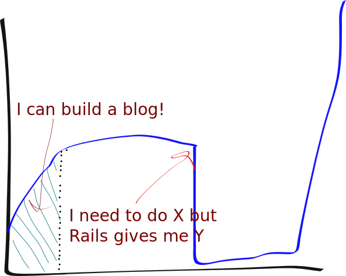
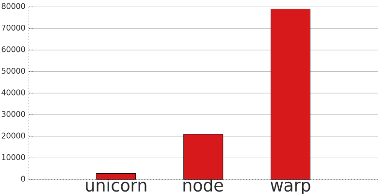

# A Typical Rails Learning Curve



# What we really want...

## Intuitive API
  - easy to get started
  - readable application code

## Easy to understand internals
  - hackable
  - coherence between what I write and what gets executed

## Expose functionality to users
  - let app developer leverage core functionality

# _Simple_ - a "framework-less" web framework 

  * No prescribed app structure enforced
    * but sane default conventions
  * Small core
    * <400 lines of code
    * can understand most of it in one source file
  * Non-core broken up into composable components
    * no special access to core primitives
    * anyone can build alternative/additional components
  * Fully-loaded:
    * Request routing
    * View templates
    * Cookie-based sessions
    * ORM for PostgreSQL

# Agenda

  * Why write web applications in Haskell?
  * A brief introduction to Haskell
  * A look under the hood of Simple
  * Walkthrough building a Simple app

# Why write web apps in Haskell?

# Why write (web apps in) Haskell?

  * Expressiveness
    * Small language core provides a lot of flexibility
    * Code can be very concise
  * Correctness / safety / security / productivity
    * Types let you reason about **what** code is doing  
      even complicated code.
    * Eliminates a whole class of bugs (anecdotally, >90% of exceptions thrown
      in YouTube are type errors).
  * Perfomance

# Throughput (req/sec) compared to Ruby, node.js



_This was done informally on my laptop, but more robust benchmarks have similar
results_

# A Brief Introduction to Haskell

  * Purely-functional
    * Expressions vs. Statements
    * First-class functions
    * Partial application
  * Strict type-system
    * Types known at compile time
    * Side effects are explicit
  * Advanced tools
    * Concurrency + M/N parallelism built in
    * Testing frameworks
    * `cabal` package manager
    * ...

# Hello World

```haskell
main = putStrLn "hello world"
```

# Hello World

```haskell
main = putStrLn "hello world"
```

Let's get a bit fancier:

```haskell
main = do
  putStr "What's your name? "
  name <- getLine
  putStrLn $ "Hello " ++ name ++ "!"
```

> * Each statement in the `do` block returns a value (consumed with `<-`) and
    can perform a side effect (e.g. print to the screen).

> * The `do` block let's us write statements that have side effects.

> * `main` is the root of all side effects in a program

> * The do block lets us program what side effects can happen
    * hide state
    * restrict actions by a security policy
    * provide transactional memory

# A Brief Introduction to Haskell - Primitive Types

  * `Bool`, `Char`, `Int`, `Double`...
```haskell
let amMutable = False
```
  * *type1* `->` *type2* - a function from *type1* to *type2*. For example:
```haskell
add :: Int -> Int -> Int
map :: (a -> b) -> [a] -> [b]
```
  * `(`*type1*`,` *type2*`,` ...`,` *typeN*`)` - a tuple
  * `()` - a zero-tuple, pronounced *unit*
    * kind of like `void` in C
    * there is only one value of this type, also written `()`

# A Brief Introduction to Haskell - User-defined types

* `data` or `newtype`

```haskell
data HTMLString = UnescapedHTML String | EscapedHTML String

data Maybe a = Just a | Nothing

data Either a b = Left a | Right b

newtype BlogPost = BlogPost { postTitle :: String, postBody :: String }
```

* `type` aliases

```haskell
type Point = (Double, Double)
```

# Controller code for a Blog

```haskell
main = run 3000 $ do
  settings <- newAppSettings
  controllerApp settings $ do
    get "/" $ render "welcome.html" ()

    routeName "/posts" $ do
      get "/" $ do
        posts <- findAllPosts
        render "posts/index.html" posts

      get "/:post_id" $ do
        postId <- queryParam' "post_id"
        routePost postId $ \post ->
            render "posts/show.html" post

      get "/:tag" $ do
        tag <- queryParam' "tag"
        posts <- findPostsByTag tag
        render "posts/index.html" posts

routePost :: DBKey -> (Post -> Controller BlogSettings ())
         -> Controller BlogSettings ()
routePost postId act = withConnection $ \conn -> do
  mpost <- liftIO $ findRow conn postId
  maybe (return ()) act mpost
```

# A Web Framework in Four Lines

```haskell
type ControllerState s = (Request, s)

newtype Controller s a = Controller {
  runController :: ControllerState s
                -> IO (Either Response a, ControllerState s)
}
```

> * A function that takes a `Request` and an app specific state
> * Might generated a response, otherwise returns a value
> * The `Request` or app state might be modified
> * `IO` in the return type means we can perform `IO` side-effects

# Some building blocks to make life easier

Given a `Response`, construct a `Controller` action that
responds with it:

```haskell
respond :: Response -> Controller s ()
respond resp = Controller $ \s -> return (Left resp, s)
```

Given a value (of arbitrary type `a`), return it rather than responding:
```haskell
return :: a -> Controller s a
return val = Controller $ \s -> return (Right val, s)
```

Get the `Request` value:

```haskell
request :: Controller s Request
request = Controller $ \s -> return (Right $ fst s, s)
```

These are provided by _Simple_ but don't do anything special. Just used
everywhere.

# Let's write a routing combinator

Remember `routeName` from the example?

```
...
routeName "posts" $ do
  ...
...
```

If the first thing in the `Request` path `==` the name, match this route,
otherwise try the next action:

```haskell
routeName :: Text -> Controller s () -> Controller s ()
routeName name (Controller next) = do
  req <- request
  if (length $ pathInfo req) > 0 && name == (head $ pathInfo req)
    then Controller $ \(req, s) -> next (popHdr req, s)
    else return ()
  where popHdr req = req { pathInfo = (tail . pathInfo $ req) }
```

> * Easy to see how to you would write `routeHost`, `routeMethod`,
  `routeAccept`...

> * All these are provided but you can write your own (e.g. `routePost`).

# Trying to do this procedurally

```ruby
def posts_controller(req)
  if req["PATH_INFO"].empty?
    return [200, [], Post.all.to_json]
  end

  post_id = req["PATH_INFO"].first
  return [200, [], Post.find(post_id)]
end

def myapp(req)
  if req["PATH_INFO"].first == "posts"
    req["PATH_INFO"].shift
    if resp = posts_controller(req)
      return resp
    end
    req["PATH_INFO"].unshift("posts")
  end

  if req["PATH_INFO"].first == "users"
    req["PATH_INFO"].shift
    if resp = users_controller(req)
      return resp
    end
    req["PATH_INFO"].unshift("users")
  end

  if resp = posts_controller(req)
    return resp
  end
  return [404, [["Content-Length", 0]], ""]
end
```

# Trying to do this procedurally - OK, we need helpers

`route_name` will call pass control to a block if it matches the first path
directory:

```ruby
def route_name(req, path_name, &sub_route)
  pn = req["PATH_INFO"].shift
  if pn == path_name
    if resp = sub_route.call(req)
      return resp
    end
  end
  req["PATH_INFO"].unshift(pn)
  return nil
end
```

which let's us write:

```ruby
def myapp(req)
  resp = route_name("posts") do |req|
    resp = route_top {|_req| return [200, [], Post.all.to_json]}
    return resp || [200, [], Post.find(req["POST_INFO"].first)]
  end
  return resp if resp

  resp = route_name("users") do |req|
    ...
  end
  return resp
end
```

better, but we still have to check the return value everywhere...

can you imagine writing actual code like this?

# Continuation-passing-style (CPS) in JavaScript

You're already familiar with CPS if you've written in Node.js:

```javascript
function route_name(req, name, match_callback, fallback) {
  if (req.path_info[0] == name) {
    req.path_info.shift();
    return match_callback(req, function() {
      req.path_info.unshift(name);
      return fallback(req);
    });
  } else {
    return fallback(req);
  }
}
```

# CPS in JavaScript

So then we get to write:

```javascript
function myapp(req) {
  return route_name("posts",
    function(req, fallback) {
      return route_top(function() {
        return [200, [], get_all_posts()];
      }, function(req) {
        return [200, [], get_post(req.path[0])];
      });
    },
    function(req) {
      return route_name("users",
        function(req) {
          ...
        },
        function(req) {
          ...
        });
    });
}
```

# CPS in JavaScript

OK, and we can even refactor a bit:

```javascript
function postsController(req) {
  return route_top(function() {
    return [200, [], get_all_posts()];
  }, function(req) {
    return [200, [], get_post(req.path[0])];
  });
}

function usersController(req, fallback) { ... }

function myapp(req) {
  return route_name("posts", postsController,
    function(req) {
      return route_name("users", usersController
          postsController);
    });
}
```

* But this is pretty ugly, and not really what we want

* Also pretty sure it's not correct...

